Interactive Disassembler GUI
============================

* [About](#about)
* [Before running](#before-running)
    * [IACA](#iaca)
    * [Pypy](#pypy)
* [Running](#running)
    * [Options](#options)
* [Features](#features)
* [Bugs](#bugs)
* [Contributors](#contributors)
* [License](#license)

About
-----

Disasm is a browser-based application, built on Flask, that allows you to disassemble ELF files into Intel x86 assembly. The assembly and analysis is displayed in a browser so that you can click around and interact with it.

Before running
-----------------

1. Install [Capstone](http://www.capstone-engine.org/download.html)
2. Install the dependencies
    * `$ pip install -r requirements.txt --ignore-installed`
3. Replace the upload path and source code directory path in `config.py` with the appropriate relative paths on your machine.

### IACA

There is optional IACA integration. To use it, you must first download IACA from [Intel's website](https://software.intel.com/en-us/articles/intel-architecture-code-analyzer-download) and update variables in your config.py accordingly.

### PyPy

[PyPy](http://pypy.org/) is an alternative implementation of python that provides a considerable speedup. To use it, there is a little more setup involved.

1. Set up the requirements for pypy using either of the following methods:
    * `pip_pypy install -r requirements.pypy.txt` (regular pip doesn't install to a directory that pypy can find)
    * OR create a pypy virtualenv and `pip install -r requirements.pypy.txt` within that virtualenv
2. Ensure that you have either `c++filt` or `gc++filt` on your machine and in your `$PATH`. The demangler library we use does not work with pypy so we use command line tools instead. If you know of a python demangler library that can run on pypy, please let us know!

Running
-------

You can run the application with

```python
python run.py
```

This will run the server on top of Gunicorn, a faster, more reliable, and more robust server than Werkzeug, the default Flask server. If Gunicorn isn't working for you, or if you'd like to use Werkzeug for any other reason, you can do so by running:

```python
python app/app.py
```

If Pypy is installed, then you can run the application by running pypy instead of python:

```python
pypy run.py
```

### Options

* -f <file(s)>, --files <file(s)>
    * File(s) that you want to disassemble.

Features
--------

Features marked with an asterisk (*) require that the .dwarf_info section be defined in order to use it.

### Disassembly

The main feature of the application, an ELF executable can be disassembled into x86 assembly and displayed in the browser.

### Source code stack trace *

After selecting a line of assembly, the source code that corresponds to it can be displayed, as well as the full stack trace of function calls that refer to it.

Note: This feature requires that the source directory of the code that compiled into this executable be defined in config.py.

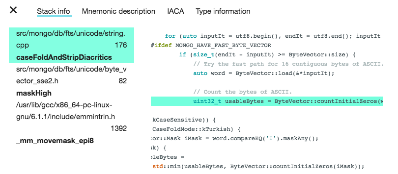

### IACA integration

A sequence of instructions can be analyzed by Intel IACA.

Note: In order to use this feature, you must first download IACA from [Intel's website](https://software.intel.com/en-us/articles/intel-architecture-code-analyzer-download) and update variables in your config.py accordingly.

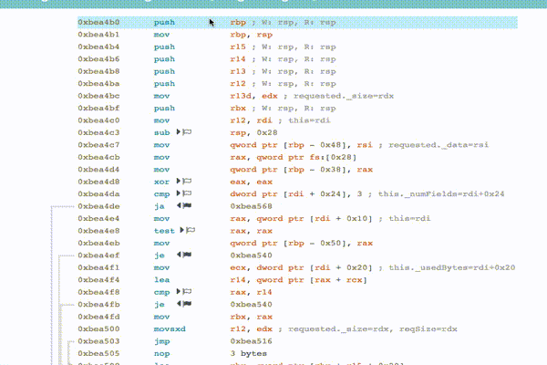

### Register contents *

Whenever possible, the contents of a register will be displayed, including the object's member that is being pointed to if a valid offset is given.

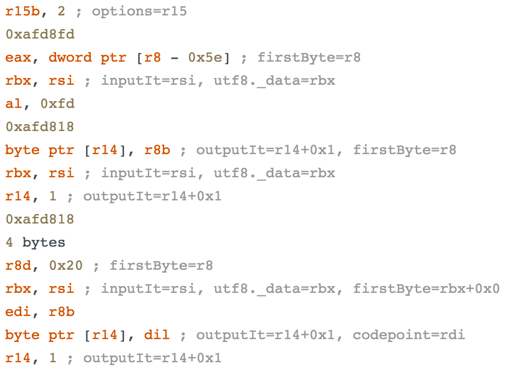

### Register tracking *

Observe which instructions read and/or write to a particular register by right clicking on the desired register and selecting the appropriate option from the dropdown menu.

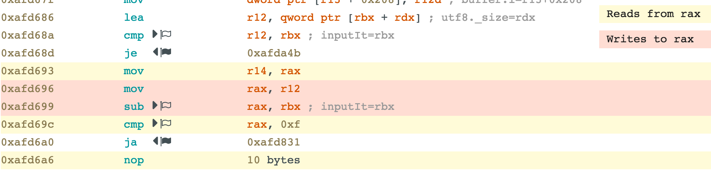

### Flags read/written

Instructions that write to a flag(s) will display a white flag next to the mnemonic. Instructions that read from a flag(s) will display a black flag next to the mnemonic. Hovering over the flag will display which flags are read to/written from in this operation.

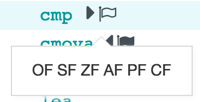

### Jump table resolution 

Jump tables are parsed. Clicking on the jump table instruction displays the mapping between each condition value and the address to jump to. Clicking on each of these addresses jumps to the respective instruction.

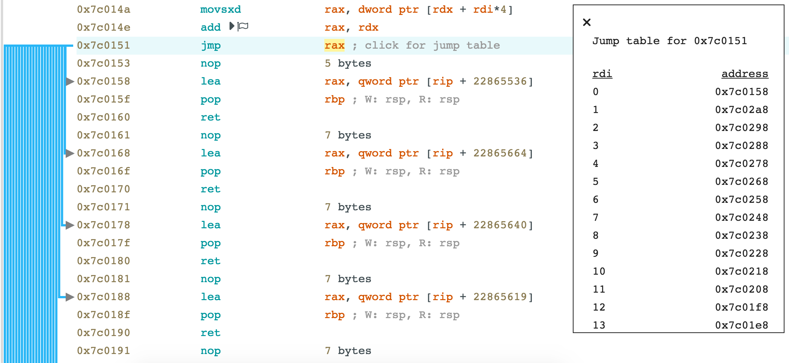

### Rip-relative address resolution and interpretation

A rip-relative adddress (e.g, `rip + 0x129d866`) can be resolved into a single address by right clicking on that part of the instruction. The value at this address can also be read from the file as an 8/16/32/64-bit signed decimal/unsigned decimal/hexadecimal/binary number, single/double precision floating point number, or null-terminated C String (up to 128 bytes).

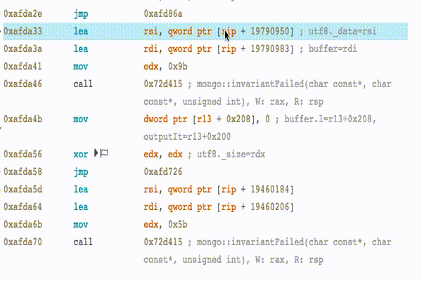

### Type analysis *

You can search for a type that is defined in this file in order to obtain obtain in-depth information about this type, including its size, subtype, and member variables. When displaying member variables, you can also see their types, their offsets, and their name.

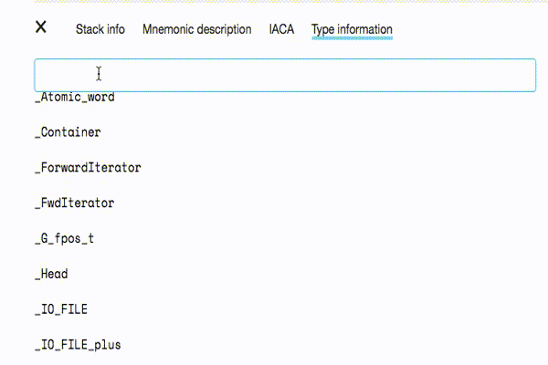

### Jumping

Clicking on the address of a jump or call instruction will allow you to jump to the address.

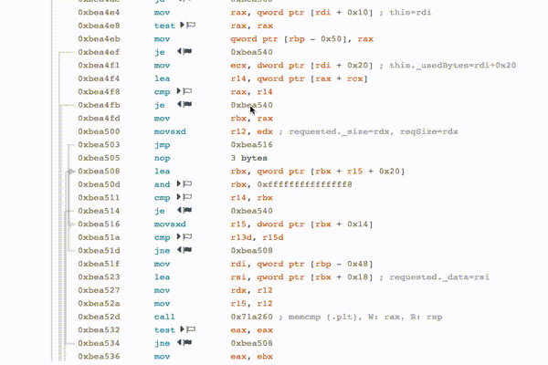

### Number conversion

By right clicking on an immediate value, you can convert it to/from decimal (signed and unsigned), hexadecimal, and binary. If the number is less than 128 in unsigned decimal, then it can also be converted to ASCII.

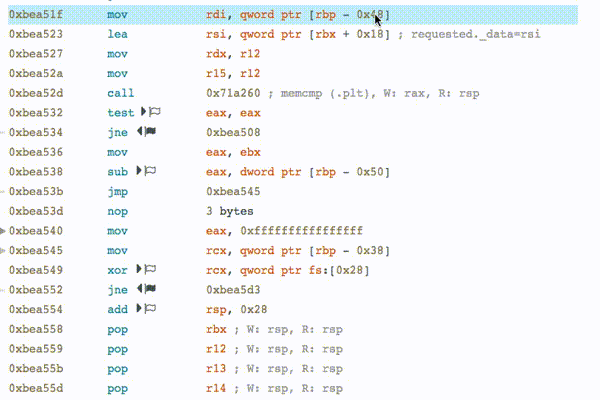

### Instruction documentation

Hovering over an instruction mnemonic will display a short explaination of what it does. Clicking on an instruction mnemonic will display an in-depth explaination.

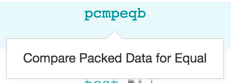

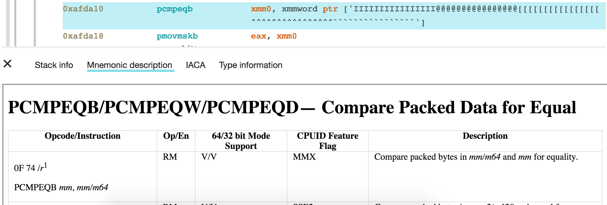

### File upload

When a file is uploaded, it will be stored on the server for quicker lookup later. These files can also be deleted.

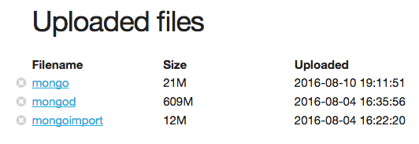

### NOP byte size

NOP operations (which are essentially meaningless) are replaced with the size of the NOP.


### Keyboard shortcuts

#### Function search

* Up/down: Navigate through the list of functions
* Enter: Disassemble the currently selected function
* ?: Display the help menu

#### Disassembly

* Up/down: Navigate through the instructions
* Right Arrow
    * On jmp/call: Go to target address
    * On ret: Return to the calling function (only available if this function was reached by entering going through a call instruction)
* Left Arrow
    * Undo previous jump/call (if applicable)
* Enter: Open the analysis window relevant to this instruction

##### Analysis window open

* Shift + up/down: Go up/down the function stack
* Tab: Cycle through the analysis tabs
* Escape: Close the analysis window

Bugs
----
If you find any bugs, please contact `hareldan95@gmail.com` or `dorothchen@gmail.com` with as much of the following information as possible:

* Version of python being run
* Source code language and version
* A link to download the executable, along with the name of the function that prodeced the bug.
* If an error/exception was raised, then the full stack trace of the error/exception.
* The browser and version of the browser being used.
* Anything else you think might be relevant.

Contributors
------------

* Dorothy Chen
* Dan Harel

License
-------

Copyright 2016 MongoDB Inc.

Licensed under the Apache License, Version 2.0 (the "License");
you may not use this file except in compliance with the License.
You may obtain a copy of the License at

  http://www.apache.org/licenses/LICENSE-2.0

Unless required by applicable law or agreed to in writing, software
distributed under the License is distributed on an "AS IS" BASIS,
WITHOUT WARRANTIES OR CONDITIONS OF ANY KIND, either express or implied.
See the License for the specific language governing permissions and
limitations under the License.
